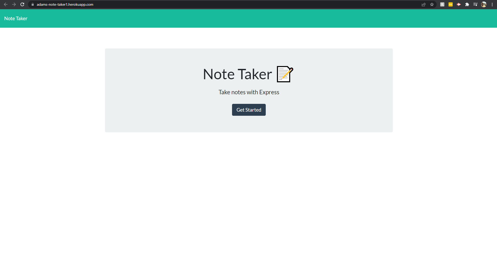
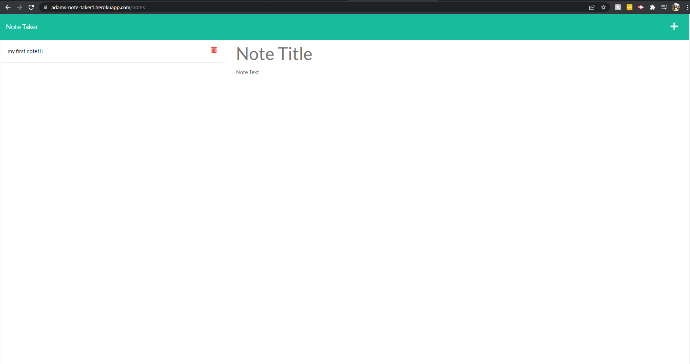

# Note Taker Starter Code

## Deployed Heroku Link To The Note Taker
https://adams-note-taker1.herokuapp.com/

## What Is It 
it is a note taker that allows you to take notes, delete notes and have them stored so even if you refresh or close your browser they will still be saved.

## How Does It Work
when using it, it takes the questions that you filled out in the terminal that were taken from the index.js file then it inputs that data into the template then the 
output is the team.html file.

## Some Of The Tech Used

html, css , javascript, json, node, jquery and heroku.

## On Startup 
When you first go to the heroku page it will look like this

then after you click get started you will be brought to this page

and here is where you make a note title and add some note text then a little save icon will show at the top right and when its clicked your note is saved and will show in the list on the left side.

# Have Fun...

